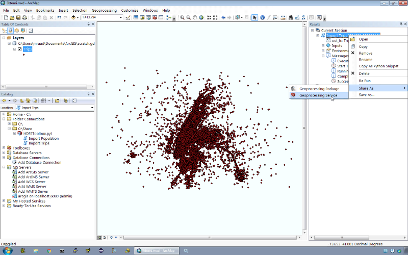

# [(Web)Mapping Elephants with Sparks](http://thunderheadxpler.blogspot.com/2016/02/webmapping-elephants-with-sparks.html)

This project is composed of tools written in Python to process and display a set of point data in CSV format from [HDFS](https://hadoop.apache.org/docs/r1.2.1/hdfs_design.html).
The processing is based on [Spark](http://spark.apache.org/), and the display on a desktop or on a web client is based on [ArcPy](http://pro.arcgis.com/en/pro-app/arcpy/get-started/what-is-arcpy-.htm).


## Getting Started

* Create an [ArcGIS Online](https://www.arcgis.com/home/) account to publish your results as WebMaps and WebApps.

* You need to access an HDFS instance. For local testing, you can download either the [Hortonworks](http://hortonworks.com/products/hortonworks-sandbox/) or the [Cloudera](http://www.cloudera.com/downloads/quickstart_vms/5-5.html) sandbox.
Of course you can "cloud" it. Cloudera released a [Docker](https://www.docker.com/) based [image](https://blog.cloudera.com/blog/2015/12/docker-is-the-new-quickstart-option-for-apache-hadoop-and-cloudera/) and [Hortonworks teamed up with Azure](http://hortonworks.com/blog/hortonworks-sandbox-with-hdp-2-3-is-now-available-on-microsoft-azure-gallery/) to enable you to take HDP for a spin. 

## Test Data

We will use the famous [NYC Taxi trips](http://www.nyc.gov/html/tlc/html/about/trip_record_data.shtml) as our test set.
I love that data set, as it contains 2 spatial and temporal elements (pickup and drop-off locations, dates and times) and additional trip attributes such as the number of passengers and the trip time.
A 1 million trip subset can be downloaded from [here](https://dl.dropboxusercontent.com/u/2193160/trips-1M.csv.7z) to be placed in your HDFS instance as follows:
 
```bash
sudo -u hdfs hadoop fs -mkdir /trips
sudo -u hdfs hadoop fs -chown root:hdfs /trips
sudo -u hdfs hadoop fs -chmod a+rw /trips

yum -y install wget p7zip
wget https://dl.dropboxusercontent.com/u/2193160/trips-1M.csv.7z
7za e -so trips-1M.csv.7z | hadoop fs -put - /trips/trips-1M.csv
```

## Mapping Prerequisites

The access to HDFS from a remote node will be performed through the [Requests](http://docs.python-requests.org/en/master/) python module using the [WebHDFS REST API](https://hadoop.apache.org/docs/current/hadoop-project-dist/hadoop-hdfs/WebHDFS.html).

To instantiate the [Requests](http://docs.python-requests.org/en/master/) class from [ArcGIS Desktop](http://www.esri.com/software/arcgis/arcgis-for-desktop), make sure that your system environment variable `PATH` contains the `ArcGIS` folder and the `Scripts` sub-folder. For example:

```
C:\Python27\ArcGIS10.3;C:\Python27\ArcGIS10.3\Scripts
```

Start a new `CMD` window as Administrator and execute:

```
pip2.7 install requests
```

To instantiate the [Requests](http://docs.python-requests.org/en/master/) class from [ArcGIS Server](http://www.esri.com/software/arcgis/arcgisserver), make sure that your system environment variable `PATH` contains the `ArcGIS` folder and the `Scripts` sub-folder. For example:

```
C:\Python27\ArcGISx6410.3;C:\Python27\ArcGISx6410.3\Scripts
```

* Stop `ArcGIS Server` from the `Services` interface.

* Start a new `CMD` window as Administrator and execute:

```
pip2.7 install requests
```

* Modify your `C:\Windows\System32\drivers\etc\hosts` file to contain the Hadoop hostname. For example:

```
192.168.1.25 sandbox.hortonworks.com mraad.cloudapp.net cloudera.quickstart sandbox
```

* Start `ArcGIS Server` from the `Services` interface.

The `hosts` modification is **very** important. When you want to [read the content of a file](https://hadoop.apache.org/docs/current/hadoop-project-dist/hadoop-hdfs/WebHDFS.html#Open_and_Read_a_File) in HDFS, you first connect to the NameNode and you request the location of the desired file.
NameNode responds with the file URL on a **DataNode**, to which you connect to and you read the streaming data from the open connection.
The response URL typically contains the **name** of the DataNode not its IP. The above mentioned `hosts` modification enables the host name resolving when using the sandbox or a cloud instance.

## Mapping The Data

To view the trips on a map, we will extend [Desktop](http://www.esri.com/software/arcgis/arcgis-for-desktop) with an ArcPy based toolbox to create an ephemeral in-memory feature class.

Create a folder connection to this project [git clone](https://git-scm.com/docs/git-clone) to access the toolbox:


The `Import Trips` tools reads the content of the trips CSV file from HDFS and parses each row for lat/lon values at specific field indexes to create an in-memory feature class of the result.


The tools performs a local filter on _all_ the retrieved rows where only the trips originating in an area around Manhattan are displayed on the map resulting to about 981,000 point features as pickup locations.


## Share As GeoProcessing

The following are the steps to publish the `Import Tool` and the other included tools as a GeoProcessing services in an ArcGIS Server instance, in such that they can be consumed from a web application using the ArcGIS [rest endpoint](http://server.arcgis.com/en/server/latest/publish-services/linux/introduction-to-geoprocessing-rest-services.htm).

* Edit the toolbox and set all the variables `in_memory` to `False`.  This will save the resulting feature class in a scratch geodatabase workspace rather than in "in-memory" workspace. ArcGIS Server provides a runtime reference to a scratch geodatabase by reading the value of `arcpy.env.scratchGDB`.  BTW, this will result in a perceivable performance degradation. On my machines, the process went from 45 sec to 1 min 24 sec. A solution (that I have to implement) is to save the features to an in-memory workspace and then perform a [copy features](http://help.arcgis.com/EN/ARCGISDESKTOP/10.0/HELP/index.html#//001700000035000000) to the scratch geodatabase.  
* Run the tool, and from the `Results` window, select `Geoprocessing Service` from the `Share As` menu item.



* **DO NOT** Publish a Service. Save a service definition file instead. In addition, make sure to **explicitly** set the `Description` to all the items even if a description already exists.  What I mean by this is that you have to explicitly type in something in the description field (type a dot at the end of the text if one exists).
* Make sure to save the service definition to `C:\temp` folder or a folder with a very short name.
* Check the option to view the results with a map service.


* Publish the service definition using the ArcGIS Server Web Manager


## Web Visualizing

The easiest way to view the result on the web is to use the ArcGIS Online [WebApp Builder](http://www.esri.com/software/web-appbuilder).


Locate the published GeoProcessing URL and use it to add A GeoProcessing Widget to the application header.


## Data Aggregation

We have been displaying about 1 million points and that has been relatively tolerable.
But what if we have billions of points or millions of files to scan in HDFS, then this becomes an "issue".
Though some folks advocate that they _need_ to see millions of dots on a map to highlight the absence of information _as_ information, the following aggregation should assist in that matter too.

The simplest aggregation that we will undertake is binning.
Imagine a virtual fishnet that is cast over the point space. All the points that fall into the same fishnet cell are aggregated together.
What is returned is the set of populated fishnet cells and their associated aggregates.
This tremendously reduces the size of the data to be visualized in what I term "Turning BigData into WebGIS Data", basically something digestible by a web client using ArcGIS<sup id="a1">[1](#f1)</sup>. 

The binning processing will be performed using [Spark](http://spark.apache.org/).

## Running the Spark Jobs

```bash
hadoop fs -rm -r -skipTrash /tmp/rowcol
spark-submit\
 --master yarn\
 --executor-memory 512m\
 --num-executors 1\
 GeoCount1.py
```

The above job aggregates the point data based on square fishnet cells.
The cell size is hardcoded to 0.001 degrees (Exercise for the reader to make cell size a program argument. Hint: use `sys.argv`) and the output is emitted to HDFS in the `/tmp/rowcol` folder.

```bash
hadoop fs -rm -r -skipTrash /tmp/rowcol
spark-submit\
 --master yarn\
 --executor-memory 512m\
 --num-executors 1\
 --py-files mercator.py\
 GeoCount2.py
```

The above job aggregates the point data based on square fishnet cells.
Unlike the previous job, the point coordinates are parsed and converted from WGS84 to WebMercator.
The cell size is 100 meters  and the output is emitted to HDFS in the `/tmp/rowcol` folder.

```bash
hadoop fs -rm -r -skipTrash /tmp/hex
spark-submit\
 --master yarn\
 --executor-memory 512m\
 --num-executors 1\
 --py-files mercator.py,hexgrid.py\
 GeoCount3.py
```

The above job aggregates the point data based on hexagonal fishnet cells.
The point coordinates are converted to WebMercator and aggregated based on 100 meter hexagonal cells and the output is emitted to HDFS in the `/tmp/hex` folder.

## Web Visualizing Aggregated Results

To view the content of the files in `hdfs:///tmp/rowcol`, use the `ImportPointDensityTool`:


Execute the tool and `Share As` a `Geoprocessing Service` the result.
Locate the Geoprocessing tool URL, and use it to add a new Geoprocessing widget to your application.


To view the content of the files in `hdfs:///tmp/hex`, use the `ImportHexTool`


Execute the tool and `Share As` a `Geoprocessing Service` the result.
Locate the Geoprocessing tool URL, and use it to add a new Geoprocessing widget to your application.


### Cloudera Docker Notes

Create a "machine" labeled `quickstart` using [VirtualBox](https://www.virtualbox.org/wiki/VirtualBox) with 4 cores, 8GB of memory and 20GB of disk space. 

```bash
docker-machine create\
 --driver virtualbox\
 --virtualbox-cpu-count 4\
 --virtualbox-memory 8192\
 --virtualbox-disk-size 20480\
 --virtualbox-no-vtx-check\
 quickstart
```

Upgrade the machine to the latest docker instance.

```bash
docker-machine upgrade quickstart
```

Run the CDH image - This will start Zookeeper, HDFS, WebHDFS, YARN, Spark and other daemons.
Note the `-v` option to share the VirtualBox created `/Users` shared folder and mount it as `/Users` in the container.
In addition, all kind of ports are opened up (4040 for Spark, 8888 for HUE, 50070 for NameNode, 50075 for DataNode) to be accessed from the "outside".
The machine IP can be retrieved using `docker-machine ip quickstart`. 

```bash
eval $(docker-machine env quickstart)
docker run\
 --rm=true\
 --privileged=true\
 --hostname=quickstart.cloudera\
 -v /Users:/Users\
 -p 4040:4040\
 -p 7180:7180\
 -p 8088:8088\
 -p 8042:8042\
 -p 8888:8888\
 -p 50060:50060\
 -p 50070:50070\
 -p 50075:50075\
 -p 21050:21050\
 -t -i cloudera/quickstart:latest\
 /usr/bin/docker-quickstart
```


### References

* <https://github.com/uncovertruth/py-geohex3>
* <http://www.neercartography.com/latitudelongitude-tofrom-web-mercator/>
* <http://www.frosties.com/index.php?option=com_mojo&Itemid=45&p=7>
* <http://effbot.org/zone/python-with-statement.htm>

<b id="f1">\[1\]</b> I've been experimenting with WebGL and the new [4.0 JavaScript API for ArcGIS](https://developers.arcgis.com/javascript/beta/) and we can now render tremendous amount of data in a web browser (as long as it can be quickly transferred from the server) - will have to post about that. [↩](#a1)
